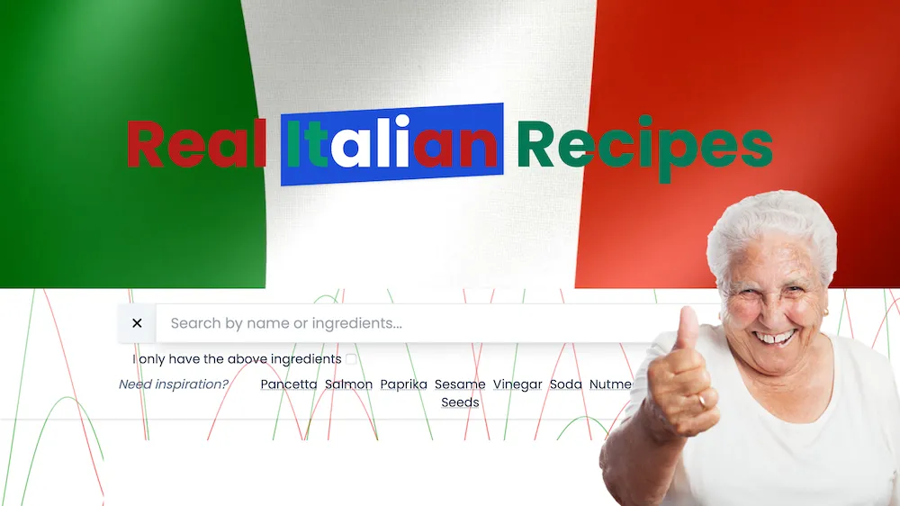

Real Italian Recipes
===

For Italian cuisine aficionados, beware from revisitation of classics and keep the tradition up.

### The story

As an Italian living abroad (and sharing my life with a non-Italian) I am constantly exposed to bullshit Italian dishes that I have never heard of growing up in Italy. This has to end.

Even when I search for a recipe online, my google search is f**ked up and I get fake Italian recipes (by fake I mean non-traditional). This also has to end.

I find myself wanting to cook and having to balance my desire to eat something I miss with the availability of ingredients in my pantry. I wanted a simple tool to help me with that.

### Sources

Most of the recipes are scraped from https://memoriediangelina.com (the only worthy source I found so far).
If you find more sources of top notch traditional Italian recipes let me know.

### Contributing

If you find good traditional Italian recipes, or for bugs/enhancements pls use the issues section.

### Complaints

Yes, I know, I'm picky about food. [Let me know how crazy and silly I am](issues/new?title=Complaint&body=%2A%2AInsert%20complaint%20here%2A%2A).
